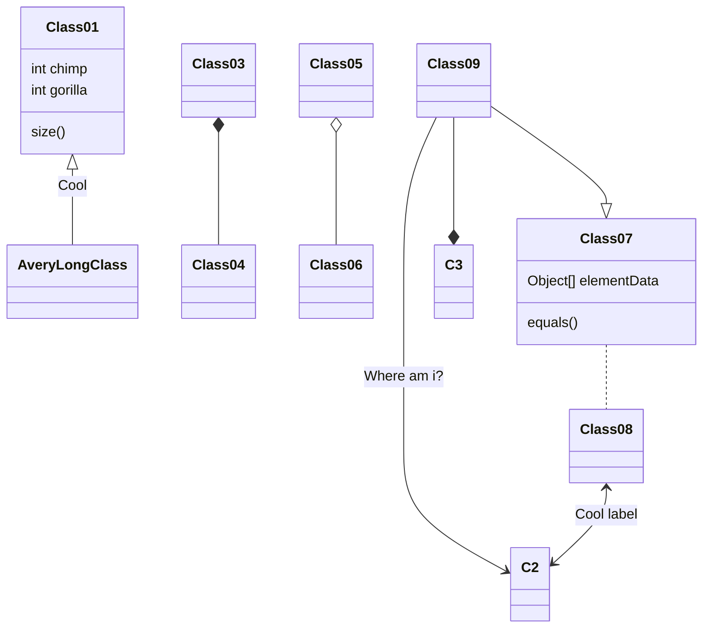

## 创建.bashrc

```java
public class Main {
    public static void main(String[] args) {
        // 打印欢迎信息
        System.out.println("Hello, World!");
        
        // 计算并输出两个数字的和
        int num1 = 5;
        int num2 = 3;
        int sum = num1 + num2;
        System.out.println("Sum: " + sum);
        
        // 打印命令行参数
        System.out.println("\nCommand line arguments:");
        for (String arg : args) {
            System.out.println("> " + arg);
        }
    }
}
```

## 进入编辑模式





## ~./.bashrc


## 使其生效


## 查看文件是否创建


## 拥有文件所有权限